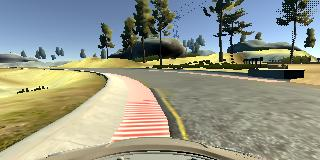

## SDC - Project 3 ([Video](https://youtu.be/KfqGwHf7-fI))
### Report

---

## Behavioral Cloning

The goals / steps of this project are the following:
* Use the simulator to collect data of good driving behavior
* Build, a convolution neural network in Keras that predicts steering angles from images
* Train and validate the model with a training and validation set
* Test that the model successfully drives around track one without leaving the road


## [Rubric Points](https://review.udacity.com/#!/rubrics/432/view)
### Files Submitted & Code Quality

#### 1. Submission includes all required files and can be used to run the simulator in autonomous mode

My project includes the following files:
* `model.py` containing the script to create and train the model using the dataset created from the simulator runs.
* `drive.py` for driving the car in autonomous mode
* `model.h5` containing a trained convolution neural network

#### 2. Submission includes functional code
Assuming the environment in which the code is being tested has all the required dependencies (python packages), the car controller for the Udacity simulator can be started by executing the code in `drive.py` file (the car can be driven autonomously around the track) by running the simulator in autonomous mode and executing:
```
python drive.py model.h5
```

#### 3. Submission code is usable and readable

The model.py file contains the code for training and saving the convolution neural network. The file shows the pipeline I used for training and validating the model, and it contains comments to explain how the code works.

### Model Architecture and Training Strategy

#### 1. An appropriate model architecture has been employed

The part of the source code responsible for the model creation is:
* `model.py`- Line 75-102

My model consists of the following layers:
* A lambda layer for data normalization in the model - `line 79`
* Three convolution layers with `5x5` filter sizes and depths of `24`, `36` and `48` - `Line 86-88`
* One convolution layer with a filter size of `3x3` and a depth of `64` - `Line 89`
* One final convolution layer with a filter size of `2x2` and a depth of `128` - `Line 90`
* All of the above layers include RELU activations to introduce nonlinearity (`lines 86 - 90`)
* A layer to flatten the output of all the convolution layers to a feature vector.
* 4 fully connected dense layers with one dropout layer to avoid overfitting.

#### 2. Attempts to reduce overfitting in the model

The model contains dropout layers in order to reduce overfitting (`model.py` line 96).

The model was trained and validated on the dataset from the first track and was tested by running it through the simulator and ensuring that the vehicle could stay on the track.

#### 3. Model parameter tuning

The model used an `ADAM` optimizer, so the learning rate was not tuned manually (`model.py` line 104).

#### 4. Appropriate training data

Training data was chosen to keep the vehicle driving on the road.

Some of the driving strategies I used to provide a good dataset are as follows:
* Center lane driving
* Recovering from the left and right sides of the road.
* Driving multiple times on different sections of the track - bridge/sections with mud-covered lane lines/sections with water in the background.

### Model Architecture and Training Strategy

#### 1. Solution Design Approach

The overall strategy was to build a robust end-to-end network architecture that would automatically extract features from the training image set and predict the steering angles.

* The network is trained to minimize the mean squared error between the steering angle produced by the network and the logged steering angle based on my driving in the simulation.

* I first started with a simple fully connected layer to test if my pipeline was up and running.

  * To test the performance of the network, I split the dataset into training and validation sets and as expected, the performance of this fully connected layer was extremely bad because the validation error (mean squared error) was extremely high, and visually inspecting the performance showed that the car was driving in circles.

* Next, I tried using the LeNet architecture with 2 sets of convolution and max-pooling layers with 1 fully connected layer. The validation error from this architecture reduced compared to the previous architecture.

  * Visually inspecting the performance showed that the car was in fact driving fairly well for the first 10% (albeit, stuttering with the steering angles) of the track but as soon as the characteristics of the track changed to include a water body in the background or different track lines or different textured roads - like bridges, the network architecture performed poorly.

* At this point, I realized that a more robust network would have a more sophisticated feature representation and decided to change the network architecture.

  * The end-to-end self driving car architecture from the team at NVIDIA was one of the main inspirations for the design of this neural network architecture. Since the problem statement they consider is very similar to the problem statement of this project, the NVIDIA architecture provided a good starting point to build a robust system for a self-driving car.

  <p align="center">
    
    <p align="center">Nvidia Network Architecture</p>
  </p>

  * I implemented a network architecture with 10 main layers. The layer configurations are as follows:
    * 1 Normalization layer - Performing normalization in the network allows the normalization
scheme to be altered with the network architecture and to be accelerated via GPU processing.

    * 1 Cropping layer - to crop out sections of the image that may not contribute to the actual controlling mechanism of the network

    * 5 Convolution layers with 'RELU' activations - to (roughly) perform the function of feature extraction (Since the system is end-to-end, it cannot be said with absolute certainty that these layers are the ONLY layers responsible for feature extraction).

    * 3 Fully connected layers - to perform the main part of the training and lead to an output control value.

  * This architecture worked much better than the LeNet architecture on most parts of the track, including the bridge and sections of the track with water in the background. Although, the network would always drive off the track at the section where one of the lane lines was covered with mud.

  * This meant that the model was over-fitting the data. To combat this problem, I added a dropout layer after the first fully connected layer and this fixed the problem.

  * This final architecture worked very well on the first test track.

#### 2. Final Model Architecture

The final model architecture (`model.py` lines 75-102) consists of a convolution neural network with the following layers and layer sizes:

* Preprocessing layers:
  * Layer 1 - Lambda layer for normalization
  * Layer 2 - Cropping layer

* (Roughly) Feature Extraction layers:
  * Layer 3 - Convolution layer with filter size 5x5, depth of 24, strides of 2,2 with a RELU activation
  * Layer 4 - Convolution layer with filter size 5x5, depth of 36, strides of 2,2 with a RELU activation
  * Layer 5 - Convolution layer with filter size 5x5, depth of 48, strides of 2,2 with a RELU activation
  * Layer 6 - Convolution layer with filter size 3x3, depth of 64, strides of 1,1 with a RELU activation
  * Layer 7 - Convolution layer with filter size 2x2, depth of 128, strides of 1,1 with a RELU activation

* Layer 8 - Flatten layer to create feature vector

* Training/Function approximation layers:
  * Layer 9 - Dense/Fully connected layer with 100 nodes
  * Layer 10 - Dropout layer to avoid overfitting with keep probability = 0.5
  * Layer 11 - Dense/Fully connected layer with 50 nodes
  * Layer 12 - Dense/Fully connected layer with 10 nodes

* Output layer
  * Layer 13 - Dense layer with 1 node


#### 3. Creation of the Training Set & Training Process

To capture good driving behavior, I first recorded two laps on track one, using center lane driving. Here is an example image of center lane driving:

<p align="center">
  
  <p align="center">Center lane driving</p>
</p>


I then recorded the vehicle recovering from the left side and right sides of the road back to center so that the vehicle would learn to generalize and recover from failures. The following images show a sequence of images recorded during a recovery from going off-track.

<p align="center">
  
  
  
  
  
  
  
  
  <p align="center">Recovering from going off-track</p>
</p>

Some of the challenging parts of the track occur along a small percentage of the track, I gathered more data around these regions by driving the simulator around these regions multiple times in forward and backward directions - this helped generalize the model for different types of tracks.

To augment the dataset, I also flipped images and angles to further help generalize the dataset. For example, here is an image that has then been flipped:

<p align="center">
  
  <p align="center">Original image</p>
</p>

<p align="center">
  
  <p align="center">Augmented image - flipped horizontally</p>
</p>

* After the collection process, I had around 15,000 data points.
* I then preprocessed this data by normalizing the pixel values within an image and cropped out sections of the image like the background and the sky - which would only contribute noise.
* I finally randomly shuffled the data set and put 20% of the data into a validation set.
* I used this training data for training the model.
* The validation set helped determine if the model was over or under fitting.
* The ideal number of epochs was 3 as evidenced by the validation error not decreasing with more epochs. In fact in some training cases the validation error would increase with more epochs.
* I used an ADAM optimizer so that manually training the learning rate wasn't necessary.

### Performance/Result Videos

I created two videos to visualize the performance of the network:

* [3rd person (Car cam) view](https://youtu.be/KfqGwHf7-fI)
* [1st person (Bumper cam) view](https://youtu.be/NfIez3m8BI8)
